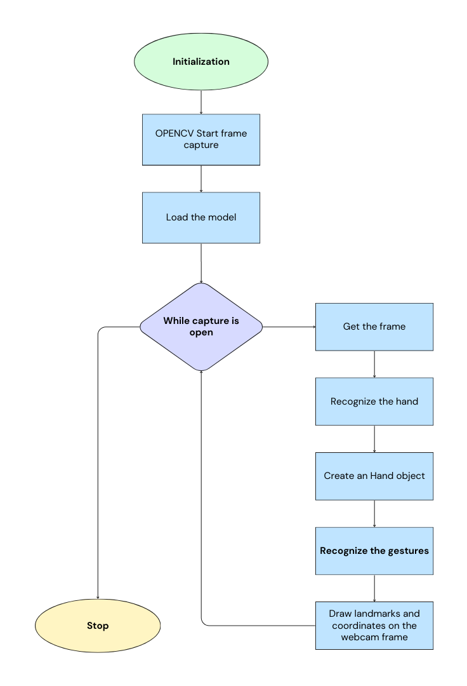
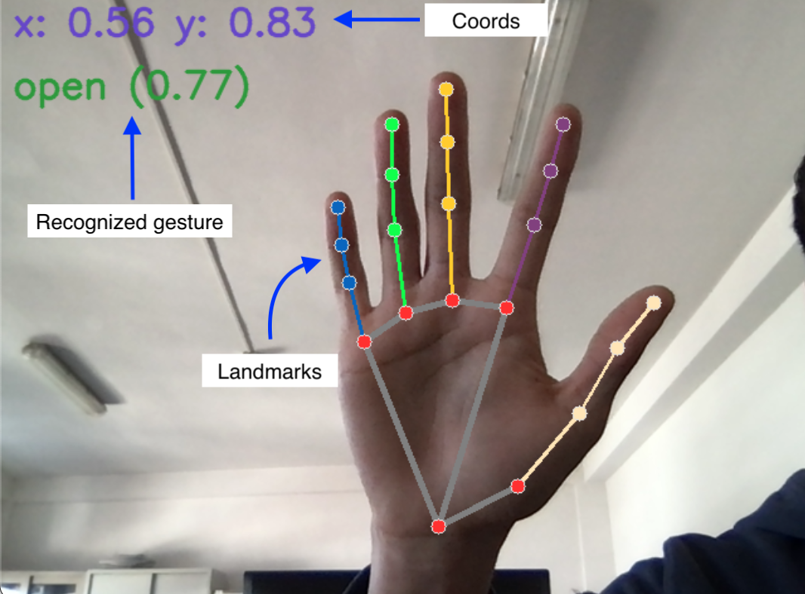

# Handflow
Move the world with your hands

### What is this?
Handflow was born as a project for a scholarship. It is a **hand gesture recognition software** written in Python that translates the user gestures to interact with the OS.
It is **highly modular** becouse of its `Hand` class that is mainly adaptable to every need.

## How this works?
<table>
  <tr>
    <td>
      Handflow uses the <a href="https://ai.google.dev/edge/mediapipe/solutions/vision/gesture_recognizer">Mediapipe</a> gesture recognition       task, mixed with some python OS handling libraries.<br>Here is the flowchart:
      <br><br>
      
    </td>
    <td>
      
      <br>
      In deep, to know where each hand point is located in the space, Mediapipe builds a <a href="https://ai.google.dev/edge/mediapipe/solutions/vision/gesture_recognizer">landmarks structure</a> as explained in the picture above.
      <br><br>
      As result, Handflow produces a frame like this:
      <br>
      
    </td>
  </tr>
</table>

## Project structure
```
handflow
├── main.py
├── Util.py
├── config.py
└── gestures
    ├── __init__.py
    ├── gesture.py
    └── os_interactions.py
```
The gestures folder contains the gesture handler in `gesture.py` and the `OSHandler` in `os_interactions.py`. \
Build your own handler by modifying this two files in order to do run the code you want.

### Configuration
Setup your settings in the `config.py` file.
Then, install all the required packages with
```
pip install -r requirements.txt
```
Run the program with
```
python3 main.py
```

## Train your model
In the training folder you can find a `train_data.py` file.
Make or download a dataset, then create a folder named `data` where inside there are your custom gestures folders, that will be taken as labels. \
**Handflow default structure**
```
data
├── fist
├── pinch
├── scroll
├── open
└── none
```
As you can see this project has been built with 4 default gestures:
- `open` -> Move the mouse cursor around the screen
- `fist` -> Drag the currently active window
- `pinch` -> Drag and click with the left mouse button
- `scroll` -> Scroll up/down \
The folder named `none` contains random pictures that shouldn't be classified as recognized gestures.

## Other
The folder `servo_motors` contains a project implementation where you can control 2 servo motors by sending trough UDP 8 bytes representing the x and y coordinate. \
Basically you can run the server code on a microcontroller running micropython and then invoke the `move_servo(deg)` - passing a tuple `(coords.x, coords.y)` - function when a gesture is being recognized.

